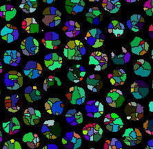

# Image analysis of a vitrified latex using Fiji/ImageJ

## The specimen

The specimen was a soft polymer latex embedded in vitreous ice and imaged
by cryo-TEM. The objective is to subtract the background (the ice has thickness
fluctuations) and then segment each latex particle. We will use shape classifiers
(circularity and aspect ratio) to select the isolated particles.

## The scripts

The scripts are written in jython

## Current issues

The watershed segmentation has a problem.

